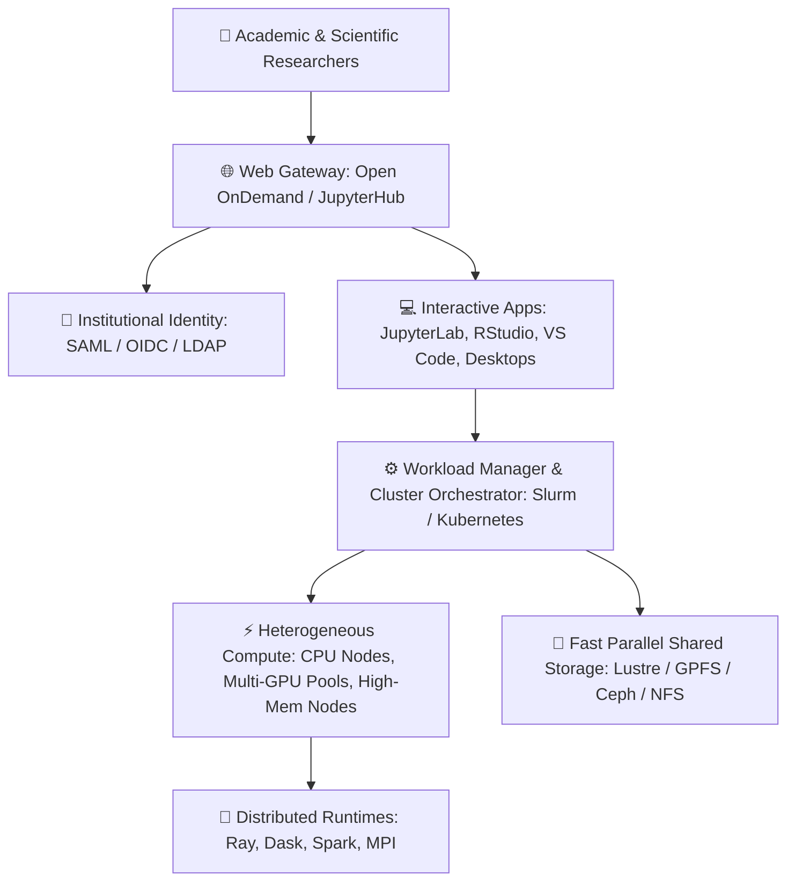

# 🚀 Awesome Research Computing Platform

  

  
  
  
  
  

---

### 🌐 High-Performance Computing (HPC), Interactive Notebooks, Cloud Supercomputing & Collaborative AI Workspaces

A comprehensive, SEO-optimized curated directory of industry-leading **SaaS Platforms** and battle-tested **Open-Source Software** powering modern **Research Computing**. These systems enable academic researchers, computational scientists, bioinformaticians, and enterprise AI teams to launch interactive IDEs (JupyterLab, RStudio, VS Code), orchestrate massive distributed compute clusters (SLURM, Kubernetes, Ray, Dask, Spark), manage reproducible experiments, and streamline access to high-performance supercomputing infrastructure.

**SEO Keywords**: `research-computing`, `high-performance-computing`, `interactive-computing`, `cloud-hpc`, `jupyterlab`, `jupyterhub`, `posit-workbench`, `rstudio`, `databricks`, `slurm-workload-manager`, `supercomputing`, `scientific-computing`, `mlops`, `dask`, `distributed-ai`, `bioinformatics-pipelines`, `open-ondemand`, `reproducible-research`.

---

## 📑 Table of Contents

- [📊 Sector Market Overview & Dynamics](#-sector-market-overview--dynamics)
- [☁️ SaaS & Hosted Research Platforms](#️-saashosted-research-platforms)
- [🔓 Open-Source GitHub Projects](#-open-source-github-projects)
- [🏗️ Reference Architecture: Building Institutional Research Computing](#️-reference-architecture-building-institutional-research-computing)
- [🤝 How to Contribute](#-how-to-contribute)
- [⭐ Star History](#-star-history)
- [📜 Disclaimer & Compliance](#-disclaimer--compliance)

---

## 📊 Sector Market Overview & Dynamics

> **Market Size & Structure (2026 Analysis):** The global market for **Research Computing & High-Performance Computing (HPC)** is estimated at **$61.0B – $65.4B**, while the broader **Cloud Data Science & AI Platforms** sector is projected to reach **$73.0B – $142.9B**. The sector exhibits **moderate fragmentation (medium market concentration)**: hyper-scale infrastructure providers and unified data leaders (e.g., Databricks) dominate enterprise analytics and AI pipelines, while a flourishing, competitive landscape of specialized collaborative notebook SaaS platforms (Posit, Hex, Deepnote) operates synergistically alongside entrenched, community-governed open-source institutional stacks (Open OnDemand, Slurm, JupyterHub).

---

## ☁️ SaaS/Hosted Research Platforms

The table below presents commercial and hosted cloud platforms for interactive data science and research computing. Entries are sorted in **descending order by company valuation / scale**.

| 🏢 Platform / Vendor | 💰 Market Valuation / Revenue | 🏷️ Specific Starting Pricing | 🎁 Specific Free Tier / Trial Limits | ⚡ Key Research & Compute Capabilities |
| :--- | :--- | :--- | :--- | :--- |
| **[Databricks](https://www.databricks.com/)** | **~$43 Billion Valuation** (ARR >$2.4B+) | **$0.07 / DBU** (Standard compute rate on AWS/Azure; Serverless SQL from $0.22/DBU) | **Databricks Free Edition** (Perpetually free tier: Serverless compute, 1 SQL warehouse of 2X-Small size, up to 5 concurrent job tasks, 1 pipeline per type, 3 apps with 24h runtime); plus **14-day cloud trial with $400 credits** | Unified data analytics, Lakehouse architecture, automated Apache Spark clusters, MLflow integration, and collaborative notebooks for distributed big data research. |
| **[JetBrains Datalore](https://www.jetbrains.com/datalore/)** | **~$7 Billion Valuation** (~$450M+ ARR for JetBrains parent) | **$29.17 / user / month** (Billed annually, or $35/user/mo billed monthly for Cloud Team) | **Cloud Free plan forever** (120 CPU S machine hours/month, 2 parallel notebooks, 10 GB cloud storage, unlimited notebooks, 1 view-only shared workspace); plus **14-day free trial** of full Cloud plan | Collaborative data science notebooks with native JetBrains IDE code intelligence, SQL support, reactive notebook execution, and report publishing. |
| **[Domino Data Lab](https://www.dominodatalab.com/)** | **~$1 Billion Valuation** (~$40M ARR, $228M funding) | **$3,000 / month** ($36,000/year annual base platform subscription via quote or AWS Marketplace) | **14-day guided proof-of-concept / sandbox evaluation** with up to $500 compute credits upon enterprise request (No permanent free tier) | Enterprise MLOps platform orchestrating multi-cloud hybrid compute (AWS, Azure, GCP, on-prem HPC), reproducible containerized runs, and governance. |
| **[Posit Workbench](https://posit.co/products/enterprise/workbench/)** *(formerly RStudio)* | **~$1 Billion Valuation** (~$100M ARR, $175M total funding, PBC) | **$5 / month** (Posit Cloud Starter; Posit Workbench Enterprise starts at $4,995/year for 5 named users = $83.25/user/mo) | **Posit Cloud Free forever** (25 compute project hours/month, 25 projects, 1 shared space, 1 GB RAM, 1 CPU limit, max 1h execution time); plus **30-day evaluation license** for on-premise Workbench | Centralized institutional workspace supporting RStudio IDE, Positron, VS Code, and JupyterLab with centralized package governance and compute management. |
| **[Anaconda Cloud Notebooks](https://www.anaconda.com/)** | **~$700 Million Valuation** (~$100M+ ARR) | **$15 / user / month** (Starter plan; Pro plan at $25/user/month) | **Free tier forever** (5 GB persistent cloud storage, 5 compute hours/month of cloud notebook runtime, 30 daily AI assistant prompt credits, access to community conda repository) | Zero-install cloud Jupyter notebook environment pre-configured with curated Conda scientific packages and GPU instance attachments. |
| **[Hex](https://hex.tech/)** | **~$500 Million Valuation** (~$30M+ ARR, Series B) | **$36 / editor / month** (Billed annually, or $45/editor/mo billed monthly for Professional plan) | **Community plan free forever** (Up to 3 project authors, small compute instance with 4 GB RAM / 0.5 CPU, 7-day version history, 100 AI actions/month); plus **14-day free trial** of Team plan | Modern polyglot workspace combining SQL, Python, and R with drag-and-drop reactive components, AI generation, and shareable data applications. |
| **[Deepnote](https://deepnote.com/)** | **~$150 Million Valuation** (~$10M+ ARR, Series A) | **$39 / editor / month** (Billed annually, or $49/editor/mo billed monthly for Team tier) | **Starter plan free forever** (Up to 3 editors, 5 active projects, unlimited execution on Basic machines with 5 GB RAM / 2 vCPUs, 7-day version history, 10 AI completions/month) | Real-time multiplayer collaborative Jupyter notebook environment with live presence, commenting, scheduled notebook jobs, and database integrations. |
| **[Saturn Cloud](https://saturncloud.io/)** | **~$60 Million Valuation** (~$8M ARR, Series A) | **$0.09 / compute-hour** (Hosted Pro pay-as-you-go with $10/mo billing threshold; persistent disk storage at $0.10/GB/month) | **Free tier forever** (30 free compute hours/month with up to 4 vCPUs / 16 GB RAM, 10 GB persistent storage); plus **$100 initial trial compute credit** upon verified account sign-up | Scalable cloud computing environment optimized for Dask clusters, Ray pipelines, multi-GPU training nodes, and scalable JupyterLab instances. |
| **[CoCalc](https://cocalc.com/)** *(SageMath, Inc.)* | **~$15 Million Valuation** (~$3M ARR, bootstrapped) | **$14 / month** (Personal Standard subscription; course student licenses start at $10/student/month) | **Trial Projects free forever** (Unlimited project creation with shared CPU/RAM pools, strictly restricted from external outbound internet/pip access, 30-minute idle session timeout) | Real-time collaborative computational mathematics platform supporting Jupyter notebooks, SageMath, LaTeX typesetting, Linux terminals, and automated course grading. |

---

## 🔓 Open-Source GitHub Projects

Open-source infrastructure is the foundational bedrock of scientific research and supercomputing facilities worldwide. Below is a curated collection of leading open-source research platforms, distributed computing engines, web portals, and workflow orchestrators, **sorted in descending order by GitHub Star count**.

1. **[Apache Spark](https://github.com/apache/spark)**   
   ⚡ Multi-language engine for executing data engineering, data science, and machine learning on single-node machines or vast distributed supercomputing clusters.

2. **[Ray](https://github.com/ray-project/ray)**   
   🚀 Unified compute framework for scaling AI and Python workloads, providing distributed runtime primitives, Ray Train, Ray Data, and Ray Serve.

3. **[Polars](https://github.com/pola-rs/polars)**   
   ⚡ Blazingly fast multi-threaded DataFrame library written in Rust, utilizing Apache Arrow memory specification to deliver high-throughput tabular analytics on research compute nodes.

4. **[MLflow](https://github.com/mlflow/mlflow)**   
   🧪 Open-source platform for managing the end-to-end machine learning lifecycle, including experiment tracking, model registry, reproducible packaging, and LLM evaluation.

5. **[Marimo](https://github.com/marimo-team/marimo)**   
   📓 Next-generation reactive Python notebook for reproducible research that stores code as clean, pure Python scripts, guarantees deterministic cell execution, and exports interactive web apps.

6. **[Kubeflow](https://github.com/kubeflow/kubeflow)**   
   ☸️ Cloud-native platform dedicated to making deployments of machine learning workflows on Kubernetes simple, portable, and scalable across research data centers.

7. **[JupyterLab](https://github.com/jupyterlab/jupyterlab)**   
   💻 The core interactive development environment for Project Jupyter, supporting notebooks, interactive terminals, code consoles, and a rich plugin ecosystem.

8. **[Dask](https://github.com/dask/dask)**   
   🐍 Flexible library for parallel and distributed computing in Python, providing dynamic task scheduling and big-data arrays/dataframes that scale from laptops to institutional HPC clusters.

9. **[JupyterHub](https://github.com/jupyterhub/jupyterhub)**   
   🌐 Multi-user hub that spawns, manages, and proxies multiple instances of the single-user Jupyter notebook server, serving as the core gateway for university research departments.

10. **[ClearML](https://github.com/allegroai/clearml)**   
    🔬 Open-source MLOps suite featuring experiment tracking, automated pipeline orchestration, dataset management, and remote execution across bare-metal or cloud GPU pools.

11. **[Apache Zeppelin](https://github.com/apache/zeppelin)**   
    📊 Web-based collaborative notebook platform enabling data-driven interactive analytics with built-in connectors for Apache Spark, SQL, Python, and Scala.

12. **[Panel](https://github.com/holoviz/panel)**   
    📈 Powerful open-source data exploration and dashboarding toolkit that turns research notebooks and data analysis scripts into interactive, publishable web applications.

13. **[RStudio](https://github.com/rstudio/rstudio)**   
    📉 The premier open-source integrated development environment for R and scientific computing, featuring comprehensive debugging, workspace inspection, and plotting tools.

14. **[Nextflow](https://github.com/nextflow-io/nextflow)**   
    🧬 Data-driven computational workflow framework enabling portable, reproducible pipeline execution across Slurm, AWS Batch, Azure, and Kubernetes in life sciences and genomics.

15. **[Snakemake](https://github.com/snakemake/snakemake)**   
    🐍 Pythonic, rule-based workflow management engine designed to create reproducible and scalable data analysis pipelines that seamlessly adapt to local and cluster architectures.

16. **[BinderHub](https://github.com/jupyterhub/binderhub)**   
    📦 Cloud service engine that turns any Git repository into an interactive, reproducible computing environment hosted in Kubernetes pods with zero local installation.

17. **[Galaxy](https://github.com/galaxyproject/galaxy)**   
    🌌 Open, web-based platform for accessible, reproducible, and transparent data-intensive biomedical and computational research with extensive tool wrappers.

18. **[repo2docker](https://github.com/jupyterhub/repo2docker)**   
    🐳 Command-line tool that inspects a Git repository and automatically builds a containerized Docker image configured with JupyterLab, RStudio, or custom research environments.

19. **[CoCalc Core](https://github.com/sagemathinc/cocalc)**   
    📐 Self-hostable open-source engine powering collaborative computation with real-time synchronized editing, SageMath, LaTeX editor, and course assignment workflows.

20. **[The Littlest JupyterHub](https://github.com/jupyterhub/the-littlest-jupyterhub)**   
    🎯 Lightweight, simple JupyterHub distribution designed for 1–100 users on a single server or cloud virtual machine, perfect for small research labs and university courses.

21. **[Zero to JupyterHub on Kubernetes](https://github.com/jupyterhub/zero-to-jupyterhub-k8s)**   
    ☸️ Helm charts and comprehensive deployment guides for operating scalable, multi-tenant JupyterHub clusters across cloud providers and on-premise Kubernetes setups.

22. **[Open OnDemand](https://github.com/OSC/ondemand)**   
    🖥️ NSF-funded, leading open-source web portal (MIT licensed) providing browser-based access to institutional HPC clusters — file management, Slurm job submission, remote desktop, and interactive Jupyter/RStudio/VS Code sessions without client software installation.

---

## 🏗️ Reference Architecture: Building Institutional Research Computing

When designing an on-premise or hybrid research computing environment, research computing centers (RCS) frequently deploy a tiered architecture:

### Architectural Key Considerations:
1. **Interactive Web Portals**: Deploy **Open OnDemand** as the cluster front-door to eliminate SSH barriers for domain scientists.
2. **Standardized Reproducibility**: Leverage **repo2docker** or container images (Singularity / Apptainer / Docker) to ensure experiments run identically across platforms.
3. **Multi-Tenant Fair Sharing**: Utilize Slurm partitions and cgroups alongside resource quotas to balance interactive notebook sessions with massive batch HPC jobs.
4. **Hybrid Governance**: Blend commercial tools (e.g., Databricks, Domino, Posit Workbench) for enterprise-grade compliance, regulated health data (HIPAA), and managed scale.

---

## 🤝 How to Contribute

Contributions, updates, and additions are welcome! Please follow these guidelines:

1. 🍴 **Fork the repository** on GitHub.
2. 📝 **Add or update an entry** in `README.md` following the existing format.
   - For SaaS products: include official product link, verified pricing tier, and specific free tier / trial limits.
   - For Open-Source repos: provide repository link and verify that Stars_Badges follow the `style=social&color=white` pattern.
3. 🧪 **Check link integrity** and verify accuracy of technical details.
4. 📬 **Submit a Pull Request** with a concise description of your changes.

Find more curated awesome lists at [Awesome Awesome Awesome](https://github.com/ishandutta2007/Awesome-Awesome-Awesome)!

---

## ⭐ Star History

---

## 📜 Disclaimer & Compliance

- This repository is a **community-curated index** intended for educational and architectural reference — not an official commercial endorsement.
- Research computing platforms frequently manage protected health information (PHI), confidential genomics data, intellectual property, and export-controlled scientific workflows. Always implement rigorous authentication (MFA/SSO), role-based access control, network segmentation, and encryption in accordance with institutional IT security policies.
- Pricing, free tiers, and cloud credit structures are subject to change by respective vendors. Always confirm current rates on official vendor websites before provisioning production clusters.

---

  Built with ❤️ for research computing centers, computational scientists, and academic IT teams worldwide.

